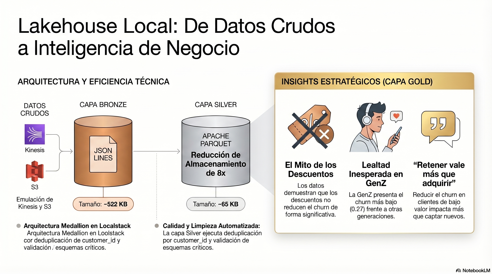
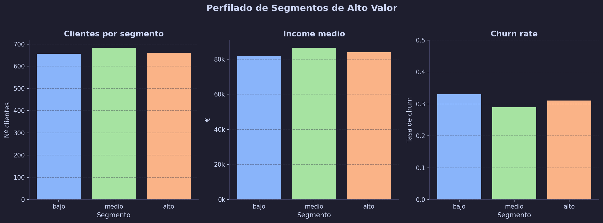
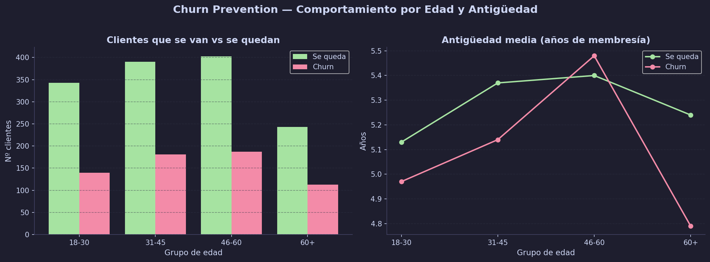
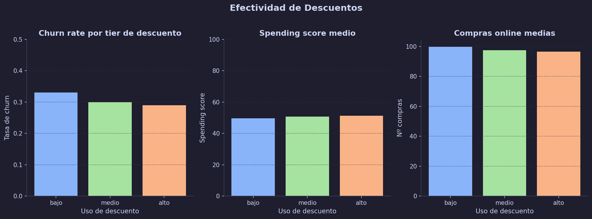
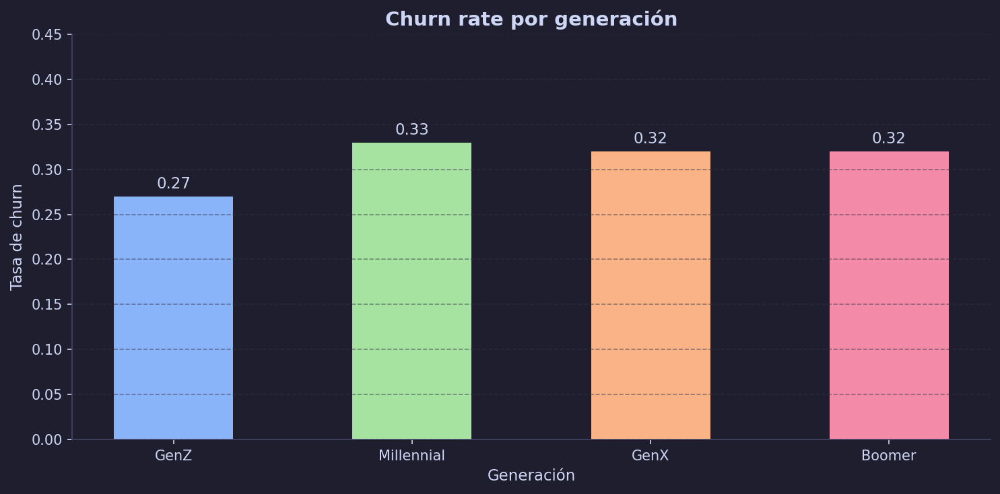
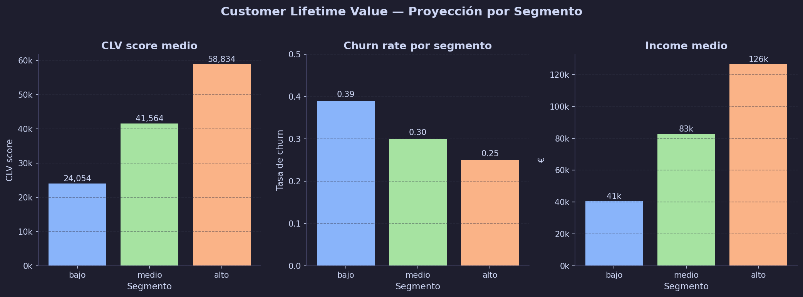

# Lakehouse Local con Localstack — Portfolio de Data Engineering

## Descripción

Pipeline de datos Medallion (Bronze → Silver → Gold) construido íntegramente en local
usando Localstack para emular AWS sin coste.

---

## Stack tecnológico

| Capa | Tecnología | Emulado con |
|---|---|---|
| Streaming | Amazon Kinesis | Localstack |
| Storage | Amazon S3 | Localstack |
| Processing | Python / pandas / pyarrow | local |
| Formato crudo | JSON Lines | — |
| Formato procesado | Apache Parquet | — |

---

## Arquitectura

 

---

## Estructura del proyecto

```text
lakehouse-local/
├── docker-compose.yml            # Configuración de Localstack
├── README.md
├── src/
│   ├── prod_kinesis.py           # Productor Kinesis
│   ├── consumer_bronze.py        # Consumidor → capa Bronze
│   ├── transform_silver.py       # Transformación → capa Silver
│   └── transform_gold.py         # Agregaciones → capa Gold
├── data/
│   ├── raw/                      # Dataset fuente (Kaggle)
│   ├── bronze/                   # Exportaciones crudas locales (opcional)
│   ├── silver/                   # Artefactos Parquet intermedios
│   └── gold/                     # Artefactos finales de negocio
├── notebooks/
│   ├── gold_analysis.ipynb       # Notebook de análisis en capa Gold
│   ├── marketing_segmentos.png   # Visualización para Marketing
│   ├── retencion_churn.png       # Visualización para Customer Success
│   ├── descuentos_efectividad.png # Visualización para Ventas
│   ├── generacional_gaps.png     # Visualización para Product / UX
│   └── clv_projection.png        # Visualización para C-Level
├── localstack-data/              # Estado local de Localstack (ignorado)
└── venv/                         # Entorno virtual Python (ignorado)
```

---

## Dataset

- **Fuente**: Kaggle — Ecommerce Customer Data
- **Registros**: 2000 clientes
- **Columnas**: `customer_id`, `age`, `gender`, `annual_income`, `spending_score`,
  `membership_years`, `online_purchases`, `discount_usage`, `churn`
---

## Capas del pipeline

### Bronze
- Consume eventos desde Kinesis con `TRIM_HORIZON`
- Guarda los datos crudos e inmutables en S3
- Formato: JSON Lines, una línea por registro
- Particionado: `year=/month=/day=/`
- Metadata añadida: `_ingestion_ts`, `_source`
- Tamaño: ~522 KB para 2000 registros

### Silver
- Lee todos los ficheros Bronze del bucket
- Limpieza: deduplicación por `customer_id`, verificación de nulls en columnas críticas
- Tipado explícito de todas las columnas según esquema definido
- Formato: Apache Parquet (compresión automática)
- Tamaño: ~65 KB — reducción de 8x respecto a Bronze
- Metadata añadida: `_processed_ts`, `_bronze_source`

---

## Visualización unificada (Gold)

Vista consolidada de los 5 análisis de negocio generados desde `notebooks/gold_analysis.ipynb`:

### 1) Marketing — Segmentación de clientes



<details>
  <summary>🔎 Ver leyenda del gráfico</summary>

## 1. Segmentos de Valor — ¿Dónde está realmente el riesgo?

El dataset divide a los 2.000 clientes en tres segmentos según su **Spending Score**:
clientes de gasto bajo, medio y alto.

## 🔎

- Los tres segmentos tienen un **tamaño similar** (~650-680 clientes cada uno).
  No hay un segmento dominante — la base de clientes está equilibrada.

- El **income medio** es prácticamente igual en los tres segmentos (81k-86k €).
  Ganar más dinero no predice cuánto se gasta. El spending score es independiente
  del income — hay clientes de renta alta que gastan poco y viceversa.

- El **churn más bajo no está en el segmento alto (0.31) sino en el medio (0.29)**.
  El cliente de gasto alto es paradójicamente menos fiel que el medio.


_El **segmento medio** es el activo **más estable de la compañía**. Marketing tiende a
perseguir al cliente de alto valor, pero los datos sugieren que defender y hacer
crecer el segmento medio tiene mejor retorno en retención. Antes de invertir en
captación de clientes premium, **conviene preguntarse por qué los que ya son premium
se van más.**_
</details>

### 2) Customer Success — Retención y churn



<details>
  <summary>🔎 Ver leyenda del gráfico</summary>

## 2. Churn Prevention — ¿Quién se va y por qué importa la antigüedad?

El **grupo de edad del cliente** y cuántos **años** lleva
**como miembro**. La antigüedad es uno de los predictores más clásicos de retención
— a más tiempo, más difícil es irse.

## 🔎

- En **todos los grupos de edad** son más los clientes que se quedan respecto a los que se van.
  El ratio es aproximadamente 2:1 en todos los segmentos — no hay un grupo
  especialmente problemático en volumen.

- En el gráfico de líneas, los clientes que **se quedan tienen consistentemente
  más años de membresía** que los que hacen churn — excepto en el grupo **46-60**,
  donde ocurre lo contrario (5.48 años los que se van vs 5.40 los que se quedan).

_La antigüedad protege la retención en casi todos los segmentos — tiene sentido,
el coste de cambio aumenta con el tiempo. Pero el segmento 46-60 rompe esa regla:
son clientes veteranos que aun así deciden irse. Esto sugiere un problema que
no es de hábito ni de inercia, sino de **propuesta de valor**. Es el segmento que
merece una investigación cualitativa — encuestas, entrevistas, análisis de
tickets de soporte. Los datos nos dicen que algo falla; no nos dicen qué._
</details>

### 3) Ventas — Efectividad de descuentos



<details>
  <summary>🔎 Ver leyenda del gráfico</summary>

## 3. Descuentos — ¿Fidelizan o solo mueven volumen?

La pregunta de negocio es directa: ¿los descuentos retienen
clientes o simplemente atraen compradores oportunistas?

## 🔎


- El **churn rate apenas varía** entre tiers: 0.33 en bajo, 0.30 en medio, 0.29 en alto.
  Una diferencia de 0.04 entre el tier más bajo y el más alto es estadísticamente
  insignificante. Los descuentos no mueven la aguja en retención.

- El **spending score sube ligeramente** con el uso de descuentos (49.54 → 51.21).
  Los descuentos generan algo más de actividad de compra, pero de forma marginal.

- Las **compras online bajan** a mayor uso de descuento (99.76 → 96.53).
  El cliente que más usa descuentos no es necesariamente el que más compra online
  — posiblemente compra en canales físicos o espera a promociones para comprar.

_Los descuentos son un instrumento de volumen puntual, no de fidelización. **Invertir
presupuesto de marketing en descuentos esperando reducir el churn es un error que
los datos desmienten**. Para mayor retención, los descuentos
deberían reservarse para reactivación de clientes inactivos o captación, no para
defender la base activa._
</details>

### 4) Product / UX — Brechas generacionales



<details>
  <summary>🔎 Ver leyenda del gráfico</summary>

## 4. Brechas Generacionales — ¿Quién es el cliente más fiel?

Segmentamos por generación: GenZ (hasta 28 años), Millennials (29-44),
GenX (45-60) y Boomers (60+). La pregunta es si la generación predice
la lealtad al producto.

## 🔎

- **GenZ tiene el churn más bajo (0.27)** — son el segmento más fiel,
  contraintuitivo para una generación que se percibe como volátil
  y con baja tolerancia a productos que no les convencen.

- **Millennials, GenX y Boomers se agrupan en torno a 0.32** — no hay
  diferencia significativa entre ellos. La generación por sí sola
  no explica el churn en estos tres grupos.

- La brecha real es **GenZ vs todos los demás**, no entre adultos
  de distintas edades.

_GenZ no solo compra más online — también se queda más. Esto sugiere
que el producto encaja especialmente bien con sus hábitos digitales
o su momento vital. La pregunta estratégica no es cómo retener
Millennials o Boomers de forma diferenciada entre sí — es entender
**qué hace que GenZ sea tan fiel y si eso es replicable** como propuesta
de valor para el resto._
</details>

### 5) C-Level — Proyección CLV



<details>
  <summary>🔎 Ver leyenda del gráfico</summary>

## 5. 👉 Valor de vida del cliente — ¿Dónde está el valor real del negocio?

Calculamos un CLV (Customer Lifetime Value) score compuesto ponderando income,
spending, antigüedad y penalizando el churn.

## 🔎

- Los tres segmentos cuentan una historia limpia y escalonada. El segmento
  **alto genera más del doble de CLV** que el bajo (58k vs 24k). La distancia
  entre segmentos es grande y está bien definida.

- El **churn cae conforme sube el CLV**: 0.39 en bajo, 0.30 en medio, 0.25
  en alto. Los clientes más valiosos son también los más fieles — aquí sí
  se cumple la intuición.

- El **income explica gran parte del CLV**: 40k en bajo, 82k en medio, 126k
  en alto. La capacidad económica del cliente es el predictor más fuerte
  de su valor a largo plazo.

_La palanca más poderosa no está en el segmento alto — ese ya funciona solo.
Está en el segmento bajo: 445 clientes con churn del 39% que se van antes
de generar valor. Reducir ese churn del 0.39 al 0.30 tendría un impacto
directo en el CLV agregado del negocio mayor que cualquier campaña de
captación de clientes premium. Retener
vale más que adquirir._
</details>

---

## Cómo ejecutar

```bash
# 1. Arrancar Localstack
cd ~/lakehouse-local && docker compose up -d

# 2. Activar entorno Python e instalar dependencias
source venv/bin/activate
pip install -r requirements.txt

# 3. Publicar eventos a Kinesis
python src/prod_kinesis.py

# 4. Consumir y guardar en Bronze
python src/consumer_bronze.py

# 5. Limpiar y escribir Silver
python src/transform_silver.py

# 6. Agregar y escribir Gold
python src/transform_gold.py
```

---

## Sincronizar capas a local (`data/`)

Forma recomendada:

```bash
cd ~/lakehouse-local
bash scripts/sync_layers.sh
```

Opcional (si quieres override de credenciales/endpoint):

```bash
cd ~/lakehouse-local

export AWS_ACCESS_KEY_ID=test
export AWS_SECRET_ACCESS_KEY=test
export AWS_DEFAULT_REGION=us-east-1
bash scripts/sync_layers.sh
```

El script usa `--delete` para mantener `data/` consistente con los buckets.

---

## Conceptos demostrados

- Patrón Producer / Consumer desacoplado con Kinesis
- Arquitectura Medallion (Bronze / Silver / Gold)
- Partition pruning con prefijos S3
- Formato columnar Parquet vs JSON Lines (8x compresión)
- Separación de compute y storage
- Agregaciones orientadas a negocio con casos de uso reales
- Emulación de AWS en local con Localstack para desarrollo sin coste

---

## Próximos pasos

- [ ] Data Quality layer con checks automáticos en S3
- [ ] Catálogo con AWS Glue Data Catalog
- [ ] Queries SQL sobre Gold con Amazon Athena
- [ ] CI/CD del pipeline con GitHub Actions
